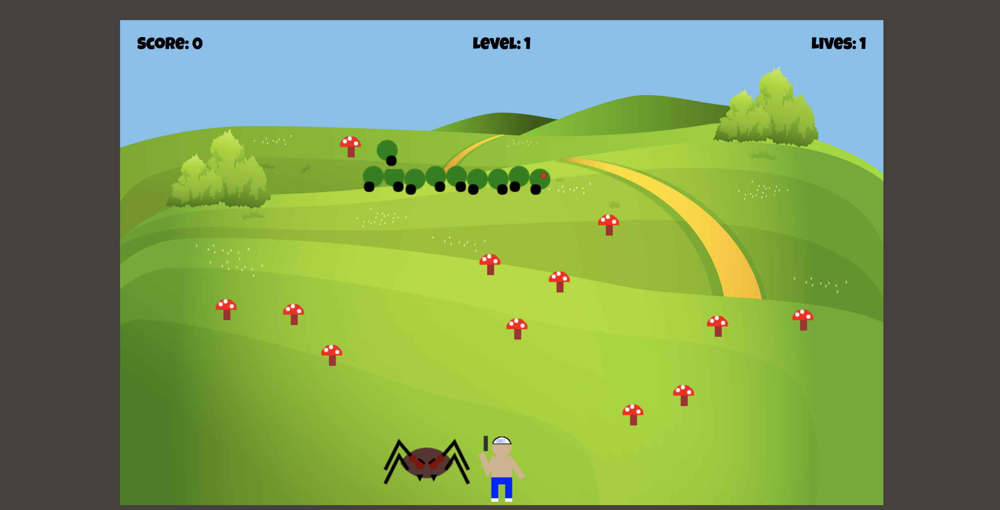

# Centipede

[Play the game!](http://kill-that-centipede.surge.sh/) 

## Project Contributors

#### Jared Eklin || https://github.com/jaredeklin
#### Patrick McLaughlin || https://github.com/patrickmc21

### Project Specs

The gametime project allowed us to re-envision the popular arcade game Centipede using CanvasJS. Objects in the game are created using Class constructor files, and each class has its own testing file to verify functionality. Built during weeks 7 and 8 in the Turing Front End Engineering program.

The objective of the game is to progess through levels by eliminating all segments of a centipede. Points are accrued on destruction of a centipede segment, eliminating a spider object, and completing a level. Lives are lost when a centipede segment or a spider makes contact with the player. The game ends when all lives are used. Game makes use of a high score feature.

### Installation

#### Clone down the repo
#### ```git clone https://github.com/jaredeklin/game-time```

#### ```npm install```

#### ```npm start```


### Tests

#### This project was developed using using Mocha and Chai testing utilities. To run the test suites for this project:

#### ```npm test```


### Project Layout



